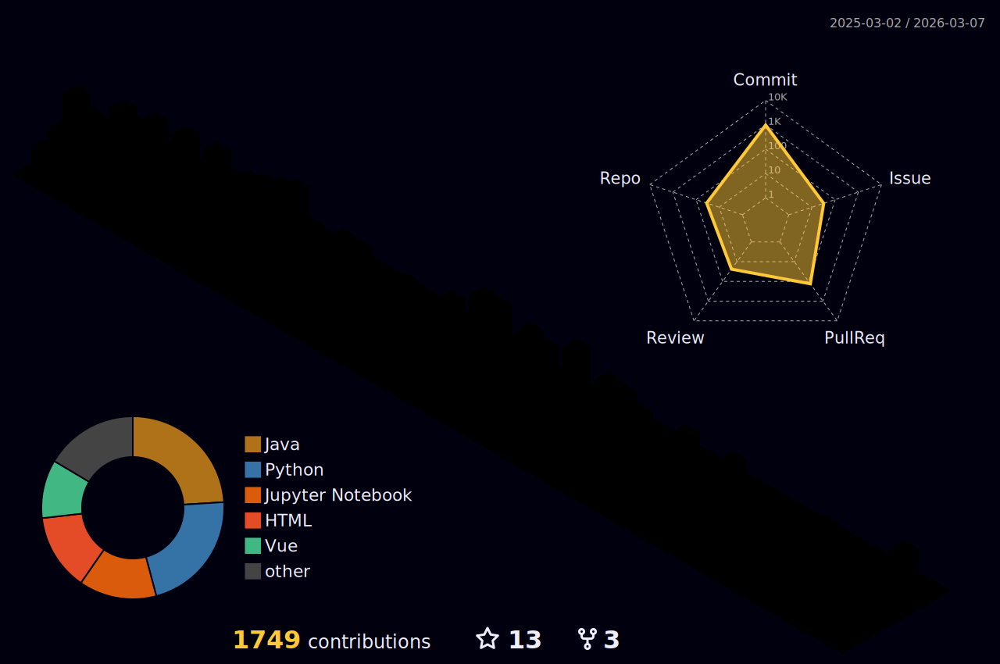

<h1 align="center"> We learn from history that we do not learn from history</h1>
<h3 align="center"><em>— Georg Wilhelm Friedrich Hegel</em></h3>

## 🚀 Working on:

  <h3><a href="https://github.com/devgabrielsborges/dynamic_clustering_fl_health_conditions">dynamic_clustering_fl_health_conditions</a></h3>
  
Dynamic Clustering Federated Learning in Concept Drift Scenarios on Health Conditions

  <h3><a href="https://github.com/devgabrielsborges/Carpenter">Carpenter</a></h3>
  
Carpenter is a job scraping tool that extracts job listings from Jobrapido and Glassdoor. It allows users to search for job titles and export the results.

  <h3><a href="https://github.com/devgabrielsborges/german_credit">german_credit</a></h3>
  
Regression task for predicting credit score based on german guidelines

<em>Last updated: 2026-02-10</em>

---

 

---

  

