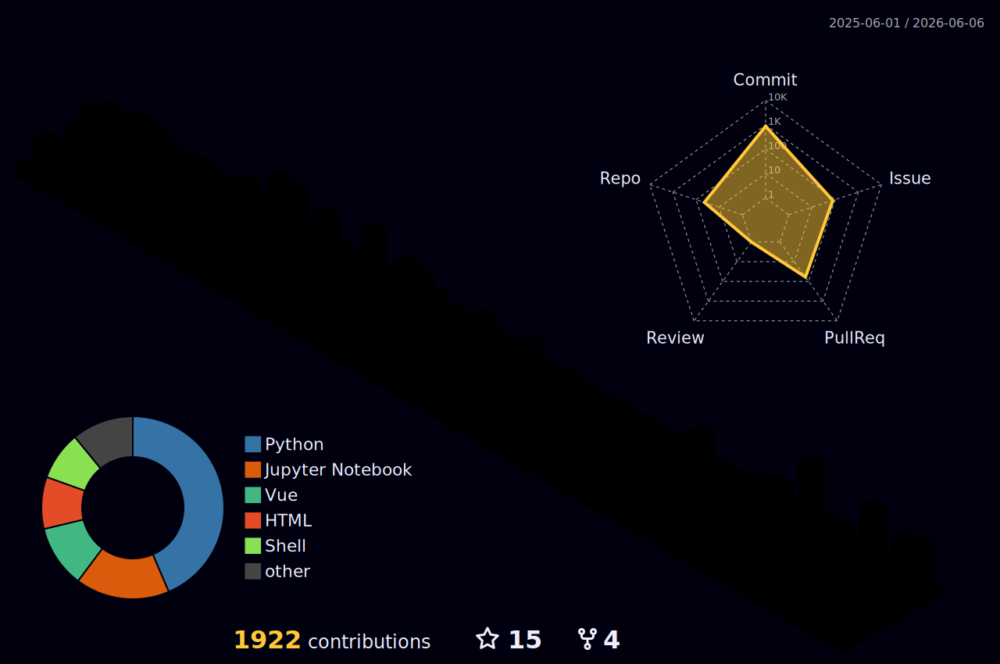

<h1 align="center"> There is nothing without a reason</h1>
<h3 align="center"><em>— Gottfried Wilhelm Leibniz</em></h3>

## 🚀 Working on:

  <h3><a href="https://github.com/devgabrielsborges/base_kaggle_comp">base_kaggle_comp</a></h3>
  
Kaggle Competition Template Repository

  <h3><a href="https://github.com/devgabrielsborges/predict_customer_churn">predict_customer_churn</a></h3>
  
Predict Customer Churn Kaggle Competition

  <h3><a href="https://github.com/devgabrielsborges/spr-2026-mammography-report-classification">spr-2026-mammography-report-classification</a></h3>
  
spr-2026-mammography-report-classification

<em>Last updated: 2026-03-30</em>

---

 

---

  

