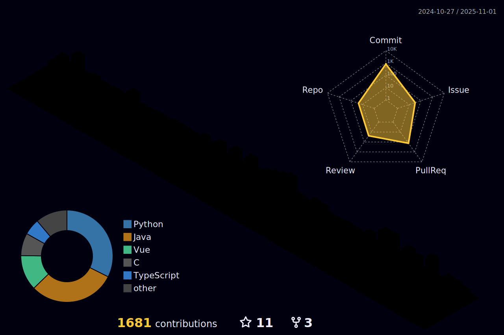

<h1 align="center"> Education is the art of making man ethical</h1>
<h3 align="center"><em>— Georg Wilhelm Friedrich Hegel</em></h3>

## 🚀 Working on:

  <h3><a href="https://github.com/devgabrielsborges/devgabrielsborges.github.io">devgabrielsborges.github.io</a></h3>
  
website

  <h3><a href="https://github.com/devgabrielsborges/autorriculum">autorriculum</a></h3>
  
LLM based application for creating CVs based on your GitHub and LinkedIn profile

  <h3><a href="https://github.com/devgabrielsborges/X-Bot">X-Bot</a></h3>
  
X-Bot is a Twitter/X automation bot that posts promotional tweets using data stored in Firebase, generates text with AI via Groq Cloud, and sends notifications via SMS with the Twilio API.

<em>Last updated: 2025-08-11</em>

---

 

---

  

